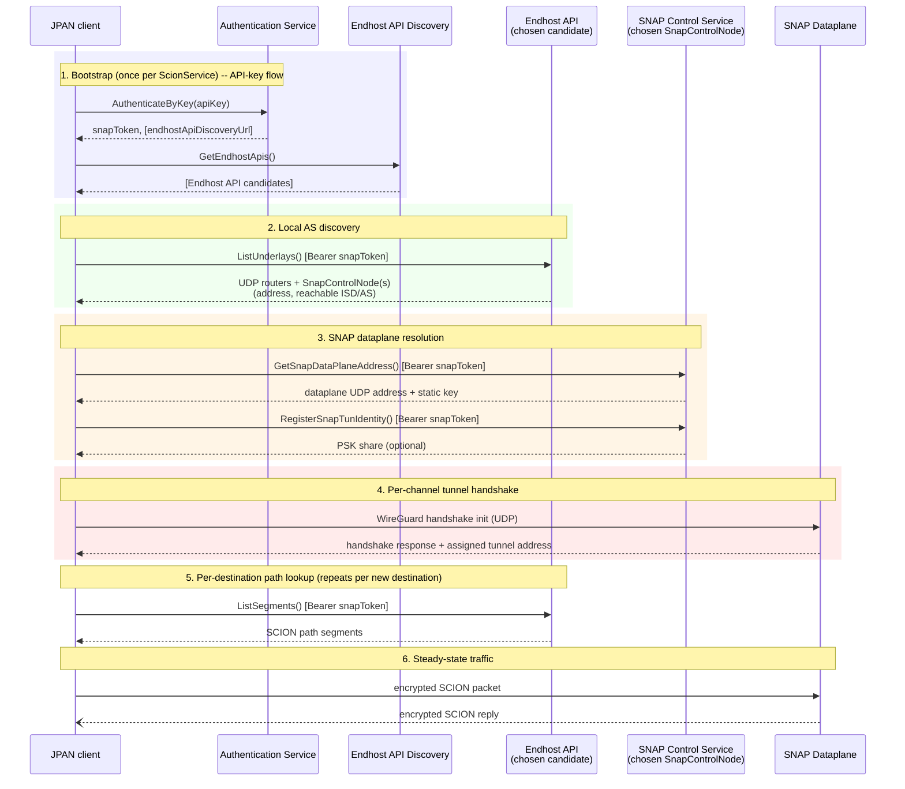

# SNAP architecture overview

SNAP tunnels SCION traffic through Anapaya's managed network. Reaching it involves up to four
distinct HTTP-over-protobuf services plus the SNAP dataplane itself. This doc maps out what each
one does, who talks to it in JPAN, and how they fit together. For the client-side channel/session
internals *after* the dataplane connection exists (the `SnapUnderlay`/`SnapTunnel`
machinery), see `SnapChannelAbstraction.md`.

## Services involved

**1. Authentication Service (AA)** -- exchanges a long-lived API key for a short-lived SNAP token
(and optionally a discovery URL scoped to the caller).
- RPC: `anapaya.aa.v1.AuthService/AuthenticateByKey`
- Config: `org.scion.snap.auth.service` / `SCION_SNAP_AUTH_SERVICE` (URL),
  `org.scion.snap.auth.key` / `SCION_SNAP_AUTH_KEY` (API key)
- JPAN: `AAClient`
- Optional: only used when an API key is configured; otherwise a SNAP token can be supplied
  directly via `org.scion.snap.authToken` / `SCION_SNAP_AUTH_TOKEN` (`--snap-token` in the demos).

**2. Endhost API Discovery Service** -- a directory of directories: given a discovery URL, returns
a prioritized list of Endhost API addresses to try.
- RPC: `endhost.discovery.v1.EndhostApiDiscoveryService/GetEndhostApis`
- Config: no dedicated property of its own -- invoked with either the URL the AA response
  returned, or the explicit `org.scion.snap.psDiscovery` / `SCION_SNAP_PS_DISCOVERY`
  (`--discovery` in the demos)
- JPAN: `EndhostApiDiscoveryClient`
- Optional: skipped entirely if a concrete Endhost API address (or list) is already configured via
  `org.scion.bootstrap.pathService`.

**3. Endhost API (path service)** -- the actual per-AS bootstrap/control-plane API. Two RPCs
matter here:
- `UnderlayService/ListUnderlays` -- returns the local AS's native UDP border routers and/or its
  SNAP node(s) (each: address + reachable ISD/AS list).
- `SegmentsService/ListSegments` -- returns SCION path segments; used for every path lookup,
  whether SNAP is involved or not.
- Config: `org.scion.bootstrap.pathService` / `SCION_BOOTSTRAP_PATH_SERVICE`, a `;`-joined
  candidate list tried in order until one responds.
- JPAN: `LocalAsFromPathService` (`ListUnderlays`, once at bootstrap), `PathServiceRpc`/
  `PathBuilder` (`ListSegments`, per path lookup).
- Auth: every call carries `Authorization: Bearer <snapToken>`.

**4. SNAP Control Service** -- the per-SNAP-node control endpoint. Two RPCs:
- `GetSnapDataPlaneAddress` -- returns the dataplane's UDP address and WireGuard static public key.
- `RegisterSnapTunIdentity` -- registers the client's identity, optionally returns a PSK share.
- Config: the address normally comes from the `SnapControlNode` the Endhost API advertised, unless
  overridden by `org.scion.snap.controlPlane` / `SCION_SNAP_CONTROL_PLANE` (`--snap-control`).
- JPAN: `SnapControlClient` -- its static `create(localAS)` factory resolves the endpoint itself
  (the override, else the first advertised `SnapControlNode`) -- invoked once per `ScionService`
  from `ScionService.initializeSnapDataPlaneIfEnabled()`.
- Auth: also carries the same Bearer SNAP token.

**5. SNAP Dataplane** -- the actual WireGuard-style UDP tunnel endpoint. Not an HTTP/protobuf
service -- a raw UDP protocol.
- Handshake: a hand-rolled Noise/WireGuard-variant handshake (X25519 + ChaCha20Poly1305 +
  Blake2s), performed once per channel session. The server assigns a tunnel source address as
  part of the handshake response.
- JPAN: `SnapTunnel` (handshake + encrypt/decrypt), wrapped by `SnapUnderlay`, wired into
  channels via `AbstractScionChannel.snapUnderlay`.
- After the handshake, every SCION packet the channel sends is wrapped in an encrypted WireGuard
  packet addressed to this endpoint; the dataplane decapsulates it and forwards it into the real
  SCION network (and vice versa for replies).

## Diagram

Steps 1-4 happen once, at `ScionService` bootstrap (and once per channel for step 4's handshake).
Step 5 repeats for every new destination. Step 6 is the ongoing data path.

## Simplified/alternate entry points

- **Token, no API key**: skip step 1 entirely; supply `org.scion.snap.authToken` (`--snap-token`)
  directly. Steps 2-6 are unchanged.
- **Explicit Endhost API, no discovery**: skip step 1's discovery sub-step; supply
  `org.scion.bootstrap.pathService` (`--endhost-api`) directly.
- **Explicit SNAP control endpoint, no per-node discovery**: skip resolving the address the
  Endhost API's `SnapControlNode` advertised; supply `org.scion.snap.controlPlane` (`--snap-control`)
  directly. Step 3 still runs, just against the overridden address.

## Known gaps

See `SnapChannelAbstraction.md`'s "Known limitations" for detail, in particular:
- Step 2 currently only ever uses the *first* `SnapControlNode` an Endhost API advertises -- multiple
  SNAP nodes serving disjoint ISD/AS sets aren't supported.
- Step 3 is resolved once per `ScionService` and cached for its lifetime -- there is no
  re-resolution if the underlying SNAP node's assignment ever changes.
